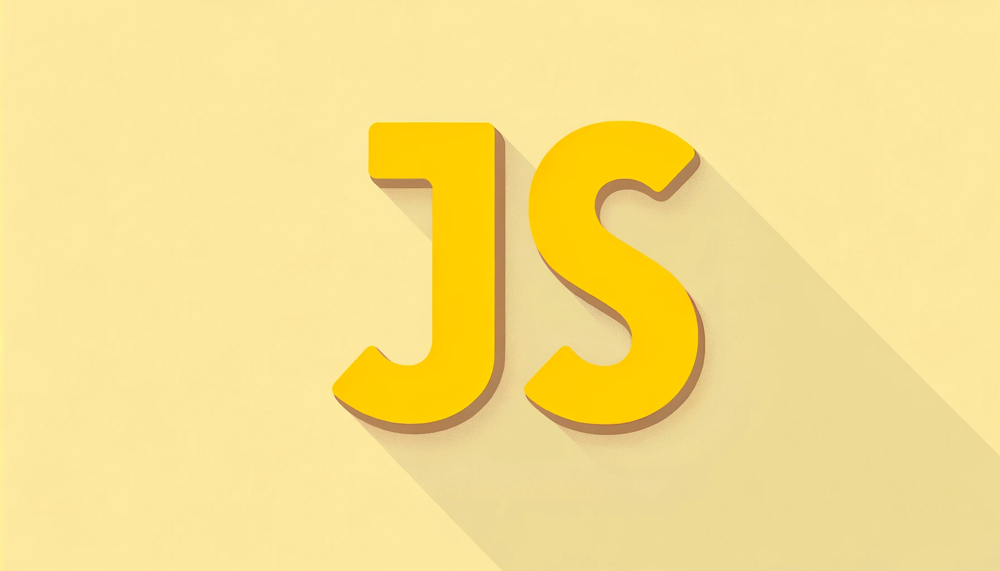

# JavaScript and Web Development Course

This course is designed to take you through the fundamentals of JavaScript and web development. Whether you're a beginner or have some experience, this course will provide you with the knowledge you need to build web applications.

Credit: This course outline is based on the content from the YouTube video titled "[JavaScript and Web Development Course](https://www.youtube.com/watch?v=EfAl9bwzVZk&ab_channel=DaveGray)" by DaveGray.

## Table of Contents

1. [Quick Start](#quick-start)
2. [Link JavaScript to HTML](#link-javascript-to-html)
3. [Strings](#strings)
4. [Numbers](#numbers)
5. [Math Methods](#math-methods)
6. [Code Challenge](#code-challenge)
7. [If Statements](#if-statements)
8. [Switch Statements](#switch-statements)
9. [Ternary Operators](#ternary-operators)
10. [User Input](#user-input)
11. [Your First Game](#your-first-game)
12. [Loops](#loops)
13. [Functions](#functions)
14. [Scope - var, let, const](#scope---var-let-const)
15. [Arrays](#arrays)
16. [Refactor the Game with Arrays](#refactor-the-game-with-arrays)
17. [Objects](#objects)
18. [Classes](#classes)
19. [JSON](#json)
20. [Handling Errors](#handling-errors)
21. [Document Object Model (DOM)](#document-object-model-dom)
22. [Event Listeners](#event-listeners)
23. [Web Storage API](#web-storage-api)
24. [Modules](#modules)
25. [Higher Order Functions](#higher-order-functions)
26. [Promises / Fetch / Async & Await](#promises--fetch--async--await)
27. [Regular Expressions](#regular-expressions)
28. [Applying RegEx in JavaScript](#applying-regex-in-javascript)

## Quick Start

Description: Get started with setting up your development environment.

## Link JavaScript to HTML

Description: Learn how to link your JavaScript files to your HTML pages.

## Strings

Description: Understand strings and how to manipulate them.

## Numbers

Description: Dive into numbers and their operations.

## Math Methods

Description: Explore various Math methods available in JavaScript.

## Code Challenge

Description: Test your skills with a coding challenge.

## If Statements

Description: Learn about conditional statements and how to use them.

## Switch Statements

Description: Understand switch statements and their use-cases.

## Ternary Operators

Description: Get to know the shorthand for conditional statements.

## User Input

Description: Learn how to capture and handle user input.

## Your First Game

Description: Build your first simple game using JavaScript.

## Loops

Description: Understand loops and how to control the flow of your program.

## Functions

Description: Dive into functions and understand their importance.

## Scope - var, let, const

Description: Learn about variable scope and the difference between var, let, and const.

## Arrays

Description: Understand arrays and how to manipulate them.

## Refactor the Game with Arrays

Description: Improve your game by incorporating arrays.

## Objects

Description: Learn about objects and how they can structure your data.

## Classes

Description: Understand classes and object-oriented programming.

## JSON

Description: Learn about JSON and how to work with APIs.

## Handling Errors

Description: Understand error handling and debugging techniques.

## Document Object Model (DOM)

Description: Learn about the DOM and how to manipulate it.

## Event Listeners

Description: Understand event listeners and how to capture user interactions.

## Web Storage API

Description: Learn about web storage and how to persist data.

## Modules

Description: Understand modules and how to organize your code.

## Higher Order Functions

Description: Dive into higher-order functions and functional programming.

## Promises / Fetch / Async & Await

Description: Learn about asynchronous programming and how to handle it.

## Regular Expressions

Description: Understand regular expressions and their applications.

## Applying RegEx in JavaScript

Description: Learn how to apply regular expressions in your JavaScript code.